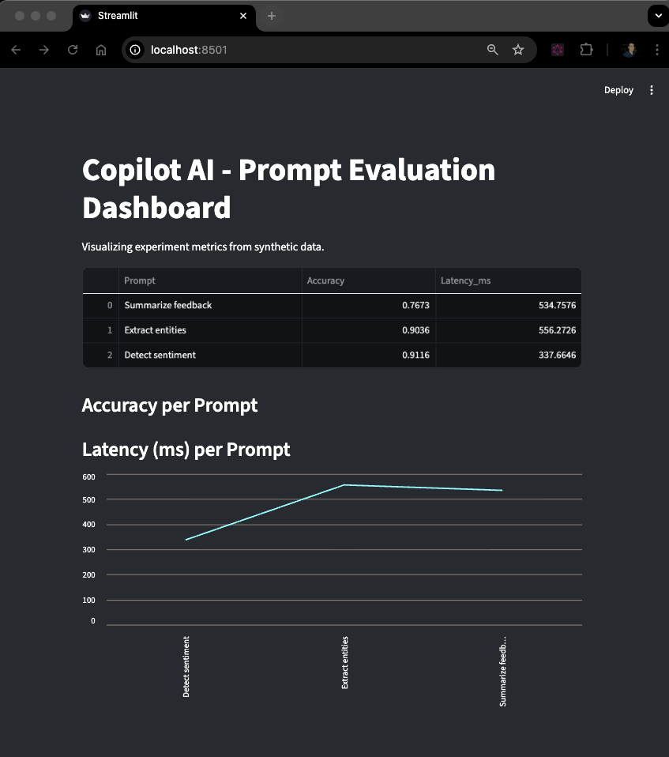
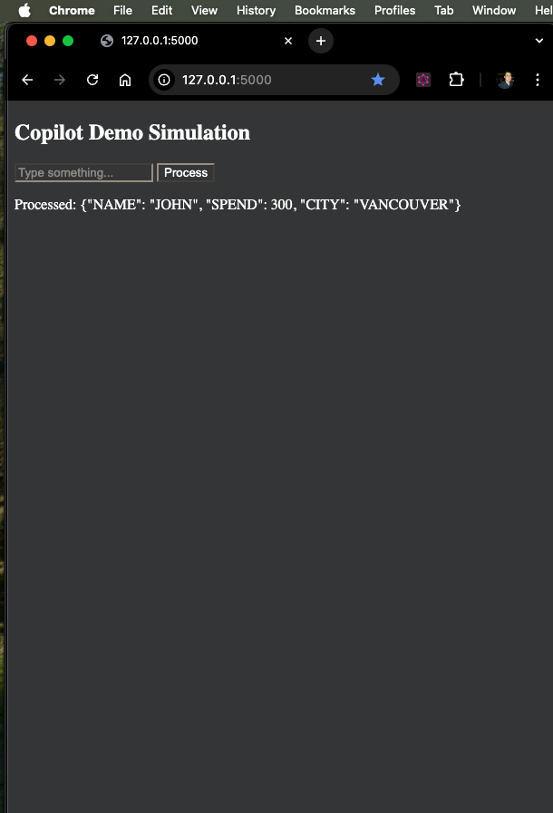

# Copilot AI - Synthetic Data and Dashboard

This repository provides a minimal example of a data generation and visualization pipeline for AI experiments.

## Components

1. **Synthetic Data Generator**
   - Located in `01_data_generation/generate_synthetic_data.py`.
   - Uses the `Faker` library to generate fake customer profiles.
   - Exports results to a CSV file.

2. **Streamlit Dashboard**
   - Located in `04_dashboard/streamlit_dashboard.py`.
   - Loads and displays experiment metrics from CSV files.
   - Handles missing file errors gracefully.

## Setup Instructions

```bash
# Create and activate virtual environment
python3 -m venv venv
source venv/bin/activate

# Install dependencies
pip install -r requirements.txt

# Generate synthetic data
python3 01_data_generation/generate_synthetic_data.py
python3 01_data_generation/clean_and_label_data.py
python3 02_etl_pipeline/etl_pipeline.py
python3 03_experiments/evaluate_prompts_simulation.py

# visualize
streamlit run 04_dashboard/streamlit_dashboard.py

# web view
python3 05_web_demo/app.py
```

## Example Output

The generated dataset includes fields such as:

| customerID | Name          | Email              | City         | Spend | Interactions |
|-------------|---------------|--------------------|--------------|--------|---------------|
| 1           | Jane Doe      | jane@example.com   | Vancouver    | 540    | 12            |
| 2           | John Smith    | john@example.com   | Toronto      | 220    | 7             |

### Streamlit Dashboard Output



### Web Demo Output



## Requirements

- Python 3.12+
- Faker, Pandas, Streamlit

## Purpose

This project is designed for testing **LLM evaluation dashboards**, **synthetic data pipelines**, and **prompt performance tracking**.
